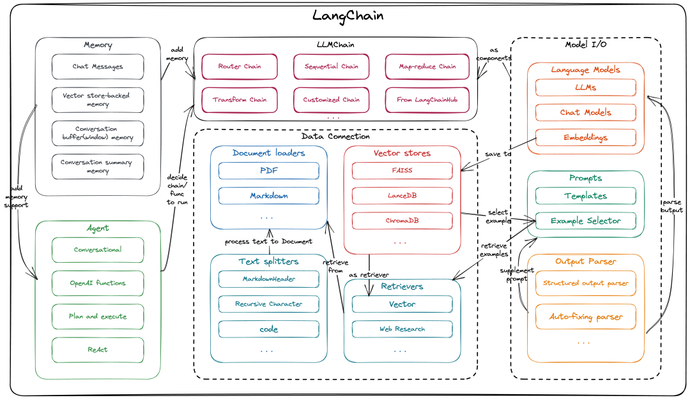
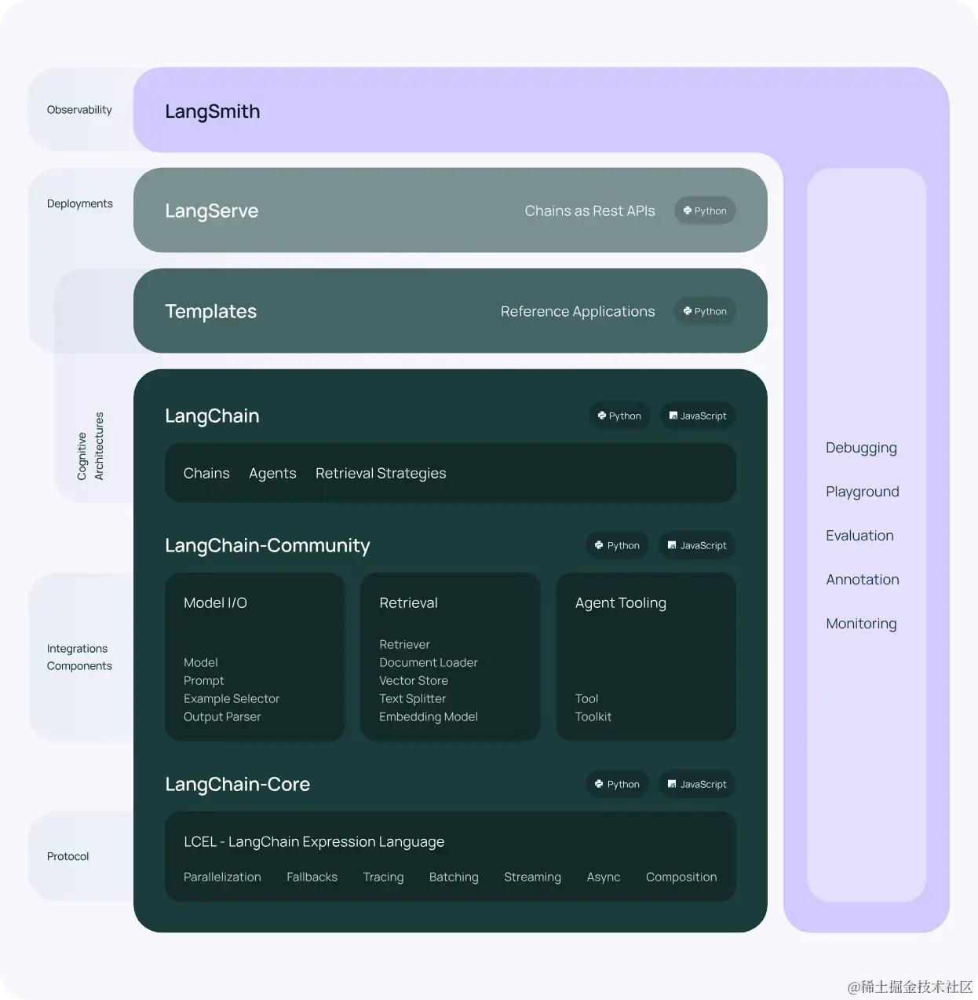

<!-- truncate -->

前面三篇文章中我们已经讨论了大模型是什么，大模型的应用场景以及开发生态。此篇文章我们主要讨论  AI 大模型的开发框架，以及他们各自做了哪些增强。

> 本篇文章中，不介绍 Dify，AutoGen 等，主要以 LangChain 和 Spring AI 为主。

## LangChain

> 官网定义：**LangChain** is a framework for developing applications powered by large language models (LLMs).
>
> 翻译为：LangChain 是一个用于开发大模型（LLMs）应用的框架。

如果看文档定义，大家可能一时感觉很迷糊，不知道什么是基于 LLMs 的应用程序。如果你看了我上一篇文章，肯定不会有这样的疑惑。

当前最为流行的 LLMs 的应用程序一个是 RAG，一个是 Agent（智能体）。LangChain 为其构建提供支持。

### LangChain 解决的问题

There are several primary needs that LangChain aims to address:

1. **Standardized component interfaces:** The growing number of [models](https://python.langchain.com/docs/integrations/chat/) and [related components](https://python.langchain.com/docs/integrations/vectorstores/) for AI applications has resulted in a wide variety of different APIs that developers need to learn and use. This diversity can make it challenging for developers to switch between providers or combine components when building applications. LangChain exposes a standard interface for key components, making it easy to switch between providers.
2. **Orchestration:** As applications become more complex, combining multiple components and models, there's [a growing need to efficiently connect these elements into control flows](https://lilianweng.github.io/posts/2023-06-23-agent/) that can [accomplish diverse tasks](https://www.sequoiacap.com/article/generative-ais-act-o1/). [Orchestration](https://en.wikipedia.org/wiki/Orchestration_(computing)) is crucial for building such applications.
3. **Observability and evaluation:** As applications become more complex, it becomes increasingly difficult to understand what is happening within them. Furthermore, the pace of development can become rate-limited by the [paradox of choice](https://en.wikipedia.org/wiki/Paradox_of_choice). For example, developers often wonder how to engineer their prompt or which LLM best balances accuracy, latency, and cost. [Observability](https://en.wikipedia.org/wiki/Observability) and evaluations can help developers monitor their applications and rapidly answer these types of questions with confidence.

官网描述如上，根据描述我们可以得出：LangChain 主要做了

1. 提供标准的组件接口：我们可以理解为屏蔽底层模型的差异，开发人员只关系其上的实现接口和功能开发即可，而不关心底层使用的是哪个模型，以及如何连接到大模型。
2. 编排：随着 Agent 不断发展，构建大型，复杂的 Agent 已经成为行业的挑战之一。LangChain 中的 Chain 便是其思想的实现，大模型应用由 Chain 组成并最终实现复杂的交互功能。
3. 可观测性和评估：在任何一个软件系统中，可观测一直是一个热门话题。通过观测，我们可以得知系统的健康程度，系统的性能瓶颈等等。在大模型应用的可观测中，我们可以看到什么样的 Prompt 是最适合的，可以让大模型给出最有用的回答。正确的评估模型可以帮助我们给出最正确的答案。

### LangChain 架构

了解每个系统组成之前，一张清晰的架构图是必不可少的：

从图中我们看出 LangChain 所做的事情和一些抽象行为。过多细节我们不再深入了。这里只是对 LangChain 有个大致了解和认知。

### LangChain 生态

上面我们结束了 LangChain 要解决的问题和架构。下面了解一下围绕 LangChain 都做了哪些更高级的开发工具和框架。

从图中，我们可以看到基于 LangChain 衍生出了一套非常庞大的大模型生态：

- LangChain ：Python 和 JavaScript 库，包含接口和集成，用于各种组件的相互组合，以及现成的 Chain 和 Agent 的实现。
- LangChain Tmpl：易于部署的各种任务的参考集合。
- LangServe：将 LangChain 应用部署为 Web 应用的组件库。
- LangSmith：开发平台。用于调试、测试、评估和监控基于 LLM 框架构建的应用，并与 LangChain 无缝集成。

## Spring AI

上面我们已经了解了 LangChain。LangChain 是由 Python 语言编写的 LLMs 开发框架，社区提供了 js 的实现。另外还有 LangChain4j，LangChain4G 等实现。原来和上述类似。

下面我们介绍一下 Spring AI，这款由 Spring 社区提供的 LLMs 应用开发框架。

> 官网：https://docs.spring.io/spring-ai/reference/index.html
>
> 官网介绍：The `Spring AI` project aims to streamline the development of applications that incorporate artificial intelligence functionality without unnecessary complexity.
>
> 翻译：Spring AI 意在简化包含人工智能应用程序的开发，避免其不必要的复杂性。

前面我们已经有了关于 LangChain 的了解。其实 Spring AI 和 LangChain 做了同样的事情，只不过 Spring AI 站在 Spring 的视角开发了 Spring 版本的 LangChain。大致思路相同，但是也在某些地方有差异。

## Spring AI Alibaba

Spring AI Alibaba 是基于 Spring AI Core 模块开发的适配 阿里通义大模型的 LLMs 应用开发框架，集成了阿里的开源中间件。方便国内开发者使用 Java 开发智能应用。生态图如下：

接下来的文章中，便以 Spring AI 和 Spring AI Alibaba 的视角深入大模型开发！
