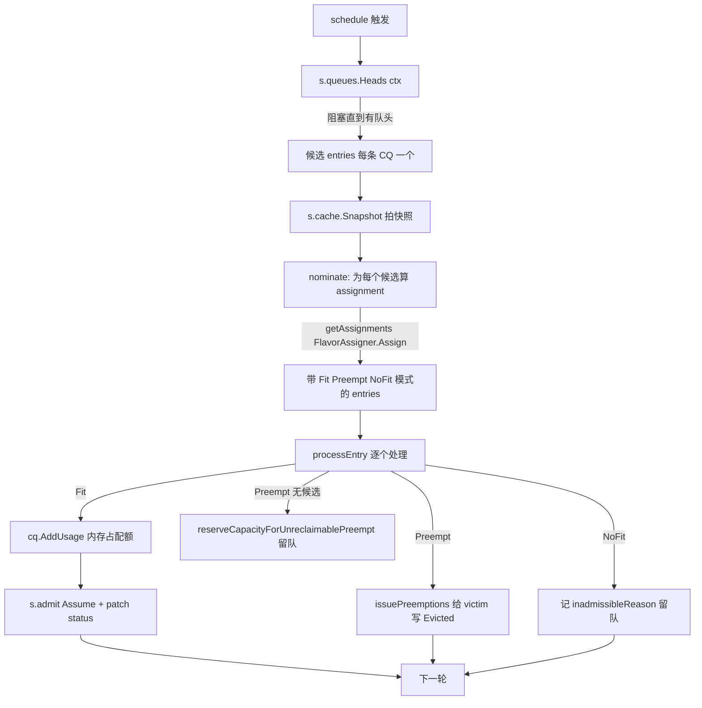
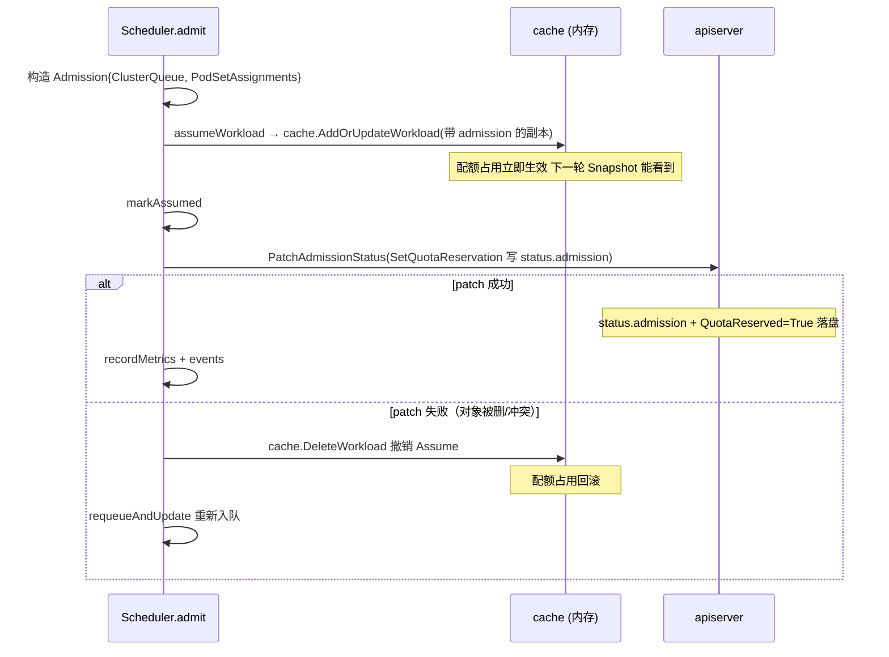

> 本文是 Kueue 源码导读系列第 3 篇。前置阅读:第 2 篇《jobframework 适配层》。
>
> 本篇聚焦 pkg/scheduler/ 与 pkg/cache/,回答一个问题:当 jobframework 把一个 Workload 写进 etcd 之后,Kueue 是怎么决定让不让它跑、用哪种资源 flavor 跑的?
>
> 读完你能回答：
>
> ① 为什么 Kueue 进程里要维护一个内存队列缓存,而不是每次去查 apiserver;
>
> ② "Snapshot" 到底拍了什么、为什么调度必须基于快照;
>
> ③ FlavorAssigner 的 Fit / Borrow / Preempt / NoFit 四态怎么决定;
>
> ④ "配额占住了" 这句话在内存和 apiserver 里各意味着什么——
>
> 这两套真相对应第 5 篇 Preemption 至关重要。
>

jobframework 产出 Workload 写入 etcd，之后 WorkloadReconciler 把它 AddOrUpdateWorkload 喂给调度器缓存。从那一刻起,后续全是 pkg/scheduler + pkg/cache 的事——jobframework 不再参与。本篇文章中将会描述此流程。

 Kueue 的调度器不监听 Pod、不绑节点。它只做一件事：在内存里算清楚"这个 Workload 能不能占住配额、用哪个 flavor"，然后把结论 patch 回 Workload.status.admission。

真正把 Pod 绑到节点仍是 K8s 原生 kube-scheduler 的事。

## Sceduler 内存队列？
首先第一时间想到的是：scheduler 每次都调用 apiserver list 所有的 pengding workload，再计算配额，patch 回去。

但是 Kueue 没有这么做，而是自己维护了一套进程内的队列缓存（pkg/cache/queue）。分析下主要有三个原因：

1. 配额状态是增量、易变的：每次有 workload 准入和驱逐，都会改变 Cohort 树上的 CQ，配额都要重新计算，从 apiserver 重建开销太大；
2. Workload 排序需要持续维护：同一个 CQ 里 Workload 要按 priority + creation time + backoff 排序，用堆更快；
3. 调度循环要快速取出“队头”：scheduler 每轮要拿每个 CQ 中最头部的 Workload，是一个 Pop 操作，apiserver 给不出来第一个，需要额外的排序成本。

所以 kueue  用 pkg/cache/queue/Manager 在内存里维护每条 CQ 的两个存储：

+ heap：queuq/cluster_queue.go，待调度的 Workload 的优先级堆，按 QueueingStrategy（StricFIFO/BestEffortFIFO）+ Priority + creation time 排序；
+ InadmissibleWorkloads：试过一次但未调度的 Workload，与堆分开存，避免挡住后面的 BestEffortFIFO。

同时 Manager 还维护 LQ 到 CQ 的映射，Cohort 树、preemption expectations、AdmissionFairSharing 的衰减消耗值。

WorkloadReconciler 每次 Workload 变更都调 Manager.AddOrUpdateWorkload 同步进缓存;scheduler 消费完调 PushOrUpdate/popPending 维护堆。

Manager 自己也是条件变量的生产者：Heads(ctx)(queue/manager.go:894）是 scheduler 取队头的入口，没有队头时它会阻塞在 cond.Wait()，等 WorkloadReconciler

```go
// 喂新 Workload 时 Broadcast 唤醒:

func (m *Manager) Heads(ctx context.Context) []workload.Info {
  m.Lock(); defer m.Unlock()
  for {
      workloads := m.heads()            // 每个 active CQ Pop 一个队头
      if len(workloads) != 0 { return workloads }
      select {
      case <-ctx.Done(): return nil
      default: m.cond.Wait()            // 没活干,挂起等唤醒
      }
  }
}
```

heads()(:913）对每个 active ClusterQueue 调 cq.Pop() 取队头，返回"本轮要尝试的候选列表"。每轮每条 CQ 最多取一个——这是 Kueue 公平性的基础:不会让一条 CQ 在一轮里把配额吃光。

> **queue cache 是 scheduler 的"待办池 + 排序器 + 配额账本",全程内存维护,通常不碰 apiserver;它是 WorkloadReconciler 写、Scheduler 读的生产者-消费者,靠 cond 变量驱动调度循环。**
>

## Scheduler Loop
pkg/scheduler/scheduler.go 的 Scheduler 由 controller-runtime 当作一个 Runnable(需 LeaderElection)周期性驱动。schedule()(:307)是一轮：



> **关键流程：Heads → Snapshot → nominate/processEntry**
>

nominate：把候选转成 entry,并初判 inadmissible(有 rejected admission check、CQ inactive、namespace 不匹配等直接标记 inadmissible 不参与分配)。合格的调 s.getAssignments 跑 FlavorAssigner.Assign 得到 assignment + preemptionTargets。

> 注意 nominate 只是"提名",真正的准入决策在 processEntry
>

processEntry：刷新 assignment(必要时重算,因为前面 CQ 可能已改变快照用量)、按 RepresentativeMode 分流、预占去重、调 admit。

### Snapshot 副本
Snapshot 内嵌 hierarchy.Manager——即一棵由 ClusterQueueSnapshot 和 CohortSnapshot 组成的树，每个节点带自己的配额(ResourceNode)、已用(Usage)、Workload 集合。ResourceFlavors 是所有 flavor 对象的副本，InactiveClusterQueueSets 是本轮被跳过的 CQ。

为什么要有快照，不能直接读 cache？因为一轮调度里多个候选要 what-if 推演:候选 A 占了某 flavor 的配额，候选 B 再算时必须看到"A 已占"的状态。如果直接改 cache，中途某次失败就污染了真实状态。

把当前候选的占用加到快照上，让后面的候选看到。这是"同轮多 CQ 公平"的实现机制——后面 CQ 的 fits 检查面对的是已被前面占用过的快照。

## FlavorAssigner：Fit/Borrow/Preempt/NoFit
kueue 根据每个 Podset 的 CoveredResource，按 CQ 里声明的 flavor 顺序一一尝试。

一个 PodSet 的多个资源、多个 flavor 的 granularMode 取最差作为代表(RepresentativeMode,:168)："任何一个资源在某 flavor 上 NoFit，整体就 NoFit；任何一个需要 Preempt,整体就 Preempt"。最终Assignment.RepresentativeMode() 落到四态之一：Fit(直接放下，可能含 borrowing)/Preempt(需抢别人)/  NoFit(放了也放不下)/无候选。

processEntry 按 mode 分流(scheduler.go:424-504):

| mode | 处理 | entry 结果 |
| --- | --- | --- |
| NoFit | 记 `e.assignment.NoFitReason` | `requeueReason=RequeueReasonNoFit`，留队下轮再试 |
| Preempt 但 `preemptionTargets` 空 | 没有可抢的 victim | `quotaReservedReason=WaitingForQuota`，`reserveCapacityForUnreclaimablePreempt` 保留容量 |
| Preempt 且 `PreemptionGate` 关闭 | gated（ConcurrentAdmission/MultiKueue 场景） | `markPreemptionGated`，留队 |
| Preempt 且有目标 | `issuePreemptions` 给 victim 写 Evicted | `quotaReservedReason=WaitingForPreemptedWorkloads`，本轮不算 admit，等下轮 victim 释放 |
| Fit | `cq.AddUsage(usage)` → admit | 真正准入 |

## 状态更新
完成上述流程之后，Kueue 会 admit，并更新 apiserver，patch 状态。



采用先更新缓存，后更新 etcd 的策略。如果反过来——先 patch apiserver 再更新 cache，scheduler 在 patch 到 cache 更新之间收到的下一轮调度可能重复准入同一个 Workload(因为它还没在 cache 里被算作已占)，造成超额。先 Assume 再 patch，下一轮 Snapshot 一定看得到占用，即使 patch 还没落盘。代价是 patch 失败要回滚内存——但 patch 失败是少数，这个 trade-off 划算。

prepareWorkload(:994)里还有 if HasAllRequiredChecks → SyncAdmittedCondition：只有当该 Workload 不需要任何 AdmissionCheck(或全部已 Ready)时，scheduler 才会顺带把 Admitted=True 也设上。否则只设 QuotaReserved=True 就返回，留给 AdmissionCheck controllers 推进(第 4 篇讲)。这就是两阶段准入的 scheduler 侧落点。

## Kueue Assume（承认） 是 preemption（抢占） 的前提？
从上面的分析中，最该重视的是 snapshot 机制，即为 podset 占住配额。

独立的 cache 和 etcd 的 status.admission。调度决策只相信内存中的 Assume，apiserver 的 status 是镜像配置，给 jobframeowrk 和运维看的。
