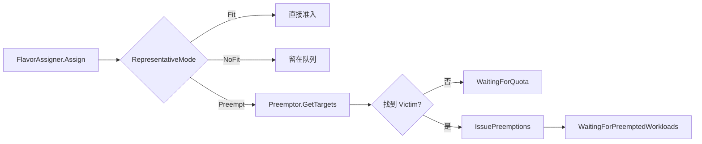
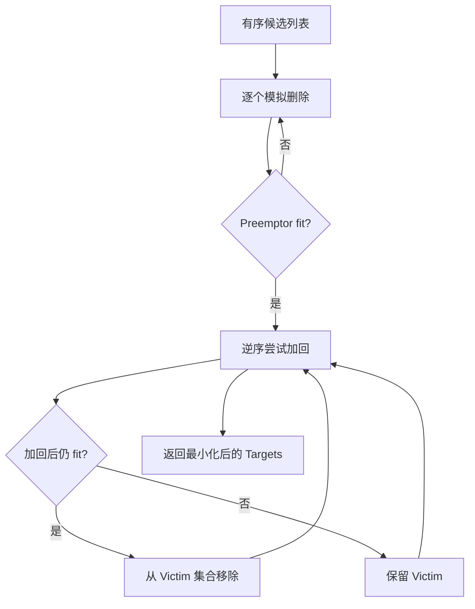

> 本文是 Kueue 源码导读系列第 6 篇，承接 Scheduler 的 `Preempt` 分支与 Workload Controller 的驱逐状态机，分析 Kueue 如何找到一组尽可能小的 Victim、发出抢占信号，并等待配额真正释放。源码基线为 Kueue `main` 分支 `80042b1a0`。
>
> 抢占不是“删除几个 Pod”这么简单。Kueue 先在调度快照中证明移除哪些 Workload 后请求能够满足，再把驱逐意图写入 API；真正停止 Job、清空 Admission 和释放配额由后续控制器异步完成。

## 抢占的触发条件

Scheduler 为 Workload 计算 FlavorAssignment 时，每个 `(ResourceFlavor, Resource)` 都会得到一个模式。只有代表模式为 `Preempt`，并且确实存在可抢占对象，才进入 Victim 搜索与驱逐流程。



### FlavorAssignment 的 Preempt 模式

`flavorResourcesNeedPreemption` 只收集 Assignment 中模式为 `Preempt` 的 flavor-resource 组合。后续候选过滤要求 Victim 必须实际使用这些资源，避免为了 GPU 不足而抢占只使用 CPU 的无关 Workload。

Preemptor 同时从 Assignment 计算新 Workload 的 quota usage 和 TAS usage。Classic/Fair Sharing 算法都在 Snapshot 副本中模拟删除候选、加入 Preemptor，再判断配额与拓扑是否能够满足。

当 Assignment 是 `Preempt` 但没有合法候选时，Scheduler 不会把 Workload 当成普通 NoFit。它记录 `WaitingForQuota`，某些情况下还会在 Snapshot 中保留可回收容量，避免更低优先级 Workload 趁 Victim 释放前继续消耗资源。

### 可回收配额与借用配额

抢占发生的资源关系主要有三类：

1. 同一个 ClusterQueue 内，高优先级 Workload 替换低优先级 Workload；
2. ClusterQueue 收回被同 Cohort 其他队列借走的 nominal quota；
3. 新 Workload 自己也需要 borrowing，同时抢占 Cohort 中更低优先级的借用者。

第二种是 reclaim：队列拿回本来属于自己的保障配额。第三种是 borrow while preempting：新 Workload 没有足够 nominal quota，即使抢占成功仍然要借用，因此限制更严格。

## ClusterQueue 抢占策略

策略定义在 `ClusterQueue.spec.preemption`：

| 字段 | 作用域 | 主要取值 |
| --- | --- | --- |
| `withinClusterQueue` | 当前 ClusterQueue | `Never`、`LowerPriority`、`LowerOrNewerEqualPriority` |
| `reclaimWithinCohort` | Cohort 中其他 ClusterQueue | `Never`、`LowerPriority`、`Any` |
| `borrowWithinCohort.policy` | 借用时跨队列抢占 | `Never`、`LowerPriority` |
| `borrowWithinCohort.maxPriorityThreshold` | 借用抢占的 Victim 上限 | 可选优先级阈值 |

所有优先级比较使用 effective priority。开启 PriorityBoost 后：

```text
effectivePriority = spec.priority + kueue.x-k8s.io/priority-boost
```

因此 PriorityBoost 会同时影响排队顺序和抢占资格，而不只是日志展示。

### WithinClusterQueue

同队列抢占解决“当前 CQ 总配额够，但被较低优先级 Workload 占住”的问题。

- `Never`：同队列不抢占；
- `LowerPriority`：只能选择 effective priority 更低的 Victim；
- `LowerOrNewerEqualPriority`：还允许抢占同优先级但创建时间更晚的 Workload。

同队列场景不涉及 quota ownership 变化，判断核心是优先级和所用 flavor-resource 是否与缺口重叠。

### ReclaimWithinCohort

当 CQ 的 nominal quota 被其他 CQ 借用时，`reclaimWithinCohort` 决定能否收回：

- `Never`：不跨队列回收；
- `LowerPriority`：只回收优先级更低的 Workload；
- `Any`：Classic Preemption 下，只要 Preemptor 能在自身 nominal quota 内放下，可以忽略 Victim 优先级。

层级 Cohort 中还要比较 Preemptor 与候选 CQ 的最低公共祖先。Preemptor 只对其拥有配额优势的子树进行 hierarchical reclaim，避免把上层共享资源误当成自己的独占配额。

### BorrowWithinCohort

`borrowWithinCohort` 允许“抢占后仍需借用”。它只适用于 Classic Preemption，不与 Fair Sharing 同时使用。

候选必须低于 Preemptor 的 effective priority；配置 `maxPriorityThreshold` 后，还必须不高于阈值。算法会区分：

- `ReclaimWithoutBorrowing`：只有 Preemptor 最终不借用时才可选；
- `ReclaimWhileBorrowing`：即使 Preemptor 最终仍借用也可选。

## Preemptor 核心结构

`pkg/scheduler/preemption/preemption.go` 中的 `Preemptor` 持有 API client、事件记录器、Workload 排序规则、Fair Sharing 配置和 `preemptionExpectations`。

对外最关键的三个方法是：

```text
GetTargets                 在 Snapshot 中计算 Victim
IssuePreemptions           把 Evicted/Preempted 写入 API
SatisfyPreemptionExpectation 观察到 API 更新后完成 expectation
```

### PreemptionContext

`GetTargets` 会构造 `preemptionCtx`，其中保存：

- Preemptor 的 WorkloadInfo 和所属 ClusterQueueSnapshot；
- 整棵调度 Snapshot；
- Workload quota/TAS usage；
- 需要抢占的 flavor-resource 集合；
- 当前时钟与日志上下文。

随后根据 Fair Sharing 是否启用，在 `classicalPreemptions` 与 `fairPreemptions` 之间二选一。

### FlavorResourcesNeedPreemption

假设一个 Workload 的 CPU 可以直接 fit，而 `gpu:nvidia-a100` 需要抢占，则候选只需围绕 A100 GPU 计算。`WorkloadUsesResources` 遍历 Victim 的 PodSet requests，只有使用目标 flavor-resource 的 Workload 才能进入候选集合。

这个裁剪同时减少了搜索量和不必要的破坏：释放无法补足当前缺口的资源，对 Preemptor 没有帮助。

## Victim 候选搜索

### ClusterQueue 范围过滤

Classic 算法分别收集：

- Preemptor 所在 CQ 的候选；
- Cohort 层级中具有 quota ownership 优势的候选；
- 只能依赖优先级策略进行跨队列抢占的候选。

Fair Sharing 则先从当前 CQ 和 Cohort 中收集满足策略的 Workload，再按各节点的 DominantResourceShare 选择优先削减的队列。

### 优先级与抢占策略过滤

`SatisfiesPreemptionPolicy` 统一处理 `Never`、`Any`、`LowerPriority` 和 `LowerOrNewerEqualPriority`。比较的不是原始 `spec.priority`，而是 PriorityBoost 调整后的 effective priority。

候选排序还会结合：

- Workload 是否已经处于 Evicted；
- 优先级与创建/重排时间；
- 是否来自 Preemptor 自己的 CQ；
- Admission Fair Sharing 等额外排序信息。

已经发出驱逐的候选优先参与模拟，因为它们的配额本来就在释放途中，不应再增加新的 Victim。

### 借用状态与 Cohort 关系

跨队列候选只有在相关 CQ 或其 Cohort 子树仍在目标资源上超出 nominal quota 时才有效。如果模拟删除前面的 Victim 后，某个子树已经回到 nominal quota 内，后续来自该子树的 Workload 会被跳过。

这使抢占判断具有动态性：候选资格不仅取决于初始状态，还取决于已经选中的 Victim 对 Cohort 树用量造成的变化。

## Victim 选择算法

### Classic Preemption

Classic Preemption 使用启发式算法寻找较小的 Victim 集合：

1. 按候选顺序逐个从 Snapshot 模拟删除；
2. 每删除一个就检查 Preemptor 是否能够 fit；
3. 一旦 fit，反向尝试把 Victim 加回；
4. 加回后仍能 fit 的 Workload 从 Victim 集合移除；
5. 恢复 Snapshot，仅返回最终 Target 列表。



它是面向工程效率的启发式，不承诺全局数学最优，但避免穷举所有 Workload 子集。

### Fair Sharing Preemption

启用 Fair Sharing 后，目标从“按优先级回收配额”扩展为“降低 Cohort 中最不公平节点的 share”。算法先把 Preemptor usage 加入快照，然后沿 Cohort 树选择 DominantResourceShare 最高且仍在 borrowing 的节点。

常用策略包括：

- `LessThanOrEqualToFinalShare`：Preemptor 加入后的 share 不高于 Victim 移除后的 share；
- `LessThanInitialShare`：Preemptor 加入后的 share 必须低于 Victim 移除前的 share。

若第一策略无法 fit，可以用剩余候选尝试第二策略。最终仍无法满足时恢复 Snapshot 并返回空列表。

### Victim 排序与最小化

Victim 排序的目标不是简单选最老或最新，而是同时满足策略、优先级和资源有效性。Classic 在选够后通过 `fillBackWorkloads` 逆向回填；Fair Sharing 也在完成 share 模拟后回填能保留的 Workload。

最终 Target 包含 `WorkloadInfo`、Victim 所属 CQ Snapshot 和抢占原因，供 API patch、事件和指标使用。

### Workload 抢占成本

PriorityBoost 是 KEP-7990 在当前代码中的落点。用户可以通过 `kueue.x-k8s.io/priority-boost` 临时调整 effective priority，表达某个 Workload 被中断或等待的相对成本。

Webhook 会校验注解必须是合法有符号整数。抢占事件同时记录 base priority、boost 和 effective priority，便于解释为什么某个 Workload 成为 Victim。

## 抢占执行

### IssuePreemptions

Scheduler 不会串行 patch 所有 Victim。`IssuePreemptions` 使用最多 8 个并行 worker，对每个 Target 调用 `workloadevict.Evict`：

- 写入 `Evicted=True, reason=Preempted`；
- 写入 `Preempted=True` 及 `InClusterQueue`、`InCohortReclamation` 等细分原因；
- 记录 Preemptor/Preemptee 的 CQ 路径和优先级；
- 发送事件并更新抢占指标。

单个 Victim patch 失败会计数并返回示例错误，但不会抹掉其他已经成功发出的驱逐。

### Evicted 与 Preempted Conditions

两个 Condition 含义不同：

- `Evicted` 告诉 JobFramework：需要停止 Job；
- `Preempted` 告诉用户和控制器：本次驱逐是由谁、在哪个范围内触发。

细分原因包括 `InClusterQueue`、`InCohortReclamation`、`InCohortFairSharing` 和 `InCohortReclaimWhileBorrowing`。下一次重新预留配额时，`SetQuotaReservation` 会把旧的 Evicted/Preempted 活跃状态重置为 False。

### Preemption Expectations

API patch 和 informer 观察之间存在时间窗。`preemptionExpectations` 以 Victim 的 namespaced name 和 UID 跟踪“已发出但尚未观察到”的抢占。

再次遇到同一 Target 时：

- 如果已经 Evicted，视为正在抢占；
- 如果 expectation 尚未满足，不重复 patch；
- Update/Delete 事件观察到目标 UID 后，调用 `ObservedUID` 解除 expectation。

UID 防止同名 Workload 删除重建后错误继承旧的抢占状态。

## Victim 的停止与配额回收

### JobFramework 停止作业

Victim 的 JobFramework 观察到 `Evicted=True` 后调用 `stopJob`：挂起 Job、删除或等待其 Pod 退出，并恢复准入时注入的 PodSet 信息。

Kueue 刻意不让 Scheduler 直接操作 Job。Scheduler 只认识 Workload，而各 Job 类型如何安全暂停，仍由相应 Integration 实现。

### Workload Admission 清理

当 Job 已不再 active，JobFramework 才调用 `UnsetQuotaReservationWithCondition`：

- 清空 `status.admission`；
- 设置 `QuotaReserved=False`；
- 同步 `Admitted=False`；
- 对抢占场景设置 `Requeued=True`。

这一步才是 API 意义上的配额释放点。仅有 Evicted Condition 时，Victim 仍保留 Admission，避免 Pod 尚未停止就把逻辑配额再次发放。

### Cache 与 Cohort 用量回退

Workload Update 事件观察到 `Admitted/QuotaReserved → Pending` 后，从 scheduler cache 删除 Victim。Cache 沿 ClusterQueue/Cohort 树扣减资源用量，并让 queue.Manager 唤醒可能受益的 inadmissible Workload。

因此资源释放链路是：

```text
Evicted Condition
  → Job 停止
  → status.admission 清空
  → Cache 删除 Workload
  → CQ/Cohort usage 回退
```

## Preemptor 的再次调度

### WaitingForPreemptedWorkloads

发出抢占后，Preemptor 不会在同一轮立即 Admission。Scheduler 为它记录 `QuotaReserved=False, reason=WaitingForPreemptedWorkloads`，并重新放回等待路径。

这是必要的，因为 Victim 的 Job 停止和 Admission 清理是异步过程；把“已经发出驱逐”误当成“配额已经释放”会造成超额准入。

### 配额释放后的重新准入

Victim 离开 cache 后，关联的 inadmissible Workload 被唤醒。Preemptor 在下一轮重新执行 FlavorAssignment 和 GetTargets：

- 若配额已经足够，模式变成 Fit 并正常 Admission；
- 若部分 Victim 尚未释放，继续等待；
- 若集群状态变化导致原 Assignment 失效，重新选择 flavor 或 Victim。

Kueue 不承诺第一次 Victim 计算结果永久有效，每轮都会基于最新 Snapshot 重新验证。

## 并发与失败场景

### 重复抢占去重

同一调度周期内，`preemptedWorkloads` 集合阻止多个 Preemptor 同时依赖重叠的 Victim。跨周期则由 preemption expectations 去重。

如果某个 Workload 只有在本轮其他抢占完成后才能 fit，它会进入 `DeferredFit`/pending preemption 路径，而不是重复驱逐同一批对象。

### Workload 并发更新

Victim 可能在 Scheduler patch 时被其他控制器更新。抢占使用宽松 apply 与冲突重试；失败时立即解除对应 expectation，允许后续周期重试。

在执行前，Scheduler 还会重新计算 Assignment，并确认处理前面 Workload 后目标仍能 fit，避免使用 nomination 阶段的过期结果。

### 抢占后 Pod 延迟终止

Workload preemption 不保证 Pod 立刻退出。Job 控制器、优雅终止时间和外部 Job 实现都可能延长释放时间。在此期间：

- Victim 仍占 cache 配额；
- Preemptor 保持 WaitingForPreemptedWorkloads；
- 其他 Workload 不能复用尚未释放的配额。

这使 Kueue 的逻辑配额与实际 Job 生命周期保持保守一致，代价是抢占延迟取决于 Victim 的停止速度。

## 小结

Kueue 抢占是一条“先证明、再发信号、最后等待回收”的异步链路：

- FlavorAssigner 标记真正需要抢占的 flavor-resource；
- Preemptor 按 ClusterQueue 策略、优先级和 Cohort quota ownership 过滤候选；
- Classic 用删除与回填启发式缩小 Victim 集合，Fair Sharing 按 DRS 修正不公平用量；
- IssuePreemptions 只写 Evicted/Preempted，不直接停止 Job；
- JobFramework 停止 Victim 后清除 Admission，cache 才释放配额；
- Preemptor 在下一轮基于新 Snapshot 重新计算并准入。

理解 Victim 回收后，下一篇可以继续深入 Cohort 树：nominal quota 如何在层级中传播、借用如何计算，以及 Fair Sharing 为什么能比较不同子树的资源份额。

## 源码索引

- `apis/kueue/v1beta2/clusterqueue_types.go`：ClusterQueue 抢占策略；
- `pkg/scheduler/preemption/preemption.go`：Preemptor、Target 与抢占执行；
- `pkg/scheduler/preemption/classical/`：Classic 与层级 Cohort 候选算法；
- `pkg/scheduler/preemption/fairsharing/`：DRS 排序与 Fair Sharing 策略；
- `pkg/scheduler/preemption/common/`：优先级策略和候选排序；
- `pkg/scheduler/scheduler.go`：Preempt 分支、重叠目标和 WaitingForPreemptedWorkloads；
- `pkg/workload/evict/evict.go`：Evicted Condition 与驱逐统计；
- `pkg/controller/jobframework/reconciler.go`：停止 Job 与清除 Admission。
