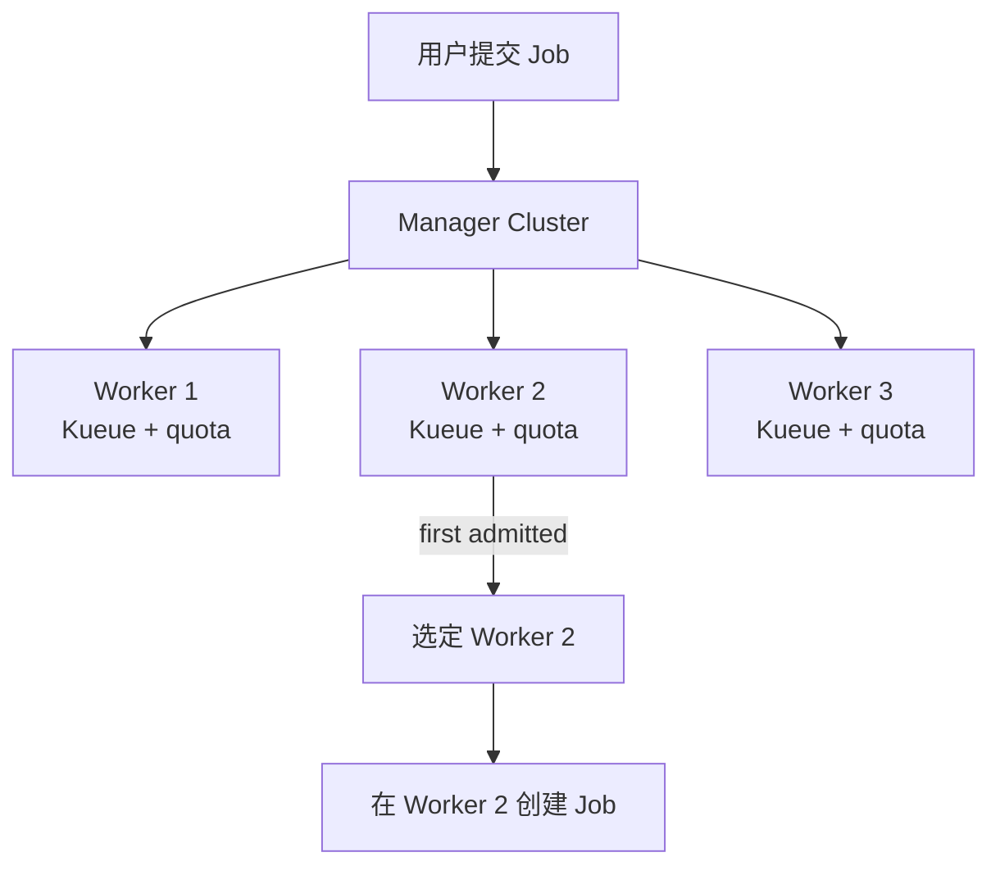
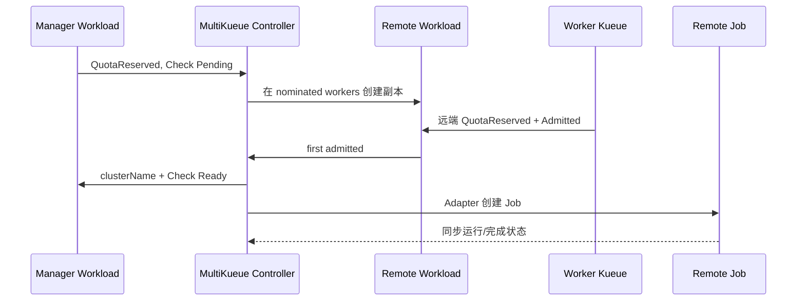
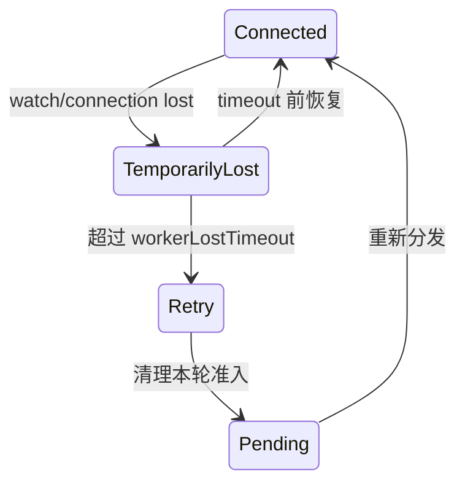

> 本文是 Kueue 源码导读系列第 10 篇，分析 MultiKueue 如何从一个管理集群把 Workload 分发到多个工作集群，让各工作集群独立执行配额准入，再把胜出集群的 Job 状态收敛回管理端。源码基线为 Kueue `main` 分支 `80042b1a0`。
>
> MultiKueue 不是跨集群 kube-scheduler。它不会把一个 PodSet 拆散到多座集群，而是为整个 Workload 选择一座工作集群，并在该集群中由本地 Kueue 与 kube-scheduler 完成后续调度。

## MultiKueue 要解决的问题

### 单集群队列的边界

单集群 Kueue 只能看到一套 API Server、节点和 ClusterQueue。组织拥有多座 GPU 集群时，提交者通常面临两个问题：

- 提交前不知道哪座集群最早有配额；
- 提交后若选错集群，需要人工删除并重提。

MultiKueue 把选择动作提升到管理集群。用户只在管理集群创建一次 Job，控制器把对应 Workload 复制到候选工作集群，最先完成准入的一方获得执行权。



### 管理集群与工作集群分工

| 位置 | 职责 |
| --- | --- |
| 管理集群 | 接收 Job、维护用户可见 Workload、选择候选集群、同步最终状态 |
| 工作集群 | 独立维护 LocalQueue/ClusterQueue、执行真实配额准入、运行 Job 与 Pod |

管理端 ClusterQueue 的 quota 首先控制“多少业务可以同时进入多集群分发流程”。真正能否运行还要由工作集群远端 Workload 的 quota 和 AdmissionChecks 决定。

## MultiKueue API

### MultiKueueCluster

`MultiKueueCluster` 描述一座工作集群及连接来源：

```yaml
apiVersion: kueue.x-k8s.io/v1beta2
kind: MultiKueueCluster
metadata:
  name: worker-east
spec:
  clusterSource:
    kubeConfig:
      locationType: Secret
      location: worker-east-kubeconfig
```

`clusterSource` 必须在 `kubeConfig` 与 `clusterProfileRef` 中二选一。连接成功并建立远端 watch 后，Controller 在 `status.conditions` 中维护 `Active`。

### MultiKueueConfig

`MultiKueueConfig` 把多座 MultiKueueCluster 组织成可供 AdmissionCheck 使用的候选集合：

```yaml
apiVersion: kueue.x-k8s.io/v1beta2
kind: MultiKueueConfig
metadata:
  name: gpu-workers
spec:
  clusters:
    - worker-east
    - worker-west
  quotaManagement: Manual
```

最多可列出 20 座集群且不能重复。对 Incremental dispatcher 来说，列表顺序具有偏好意义：默认按该顺序逐批扩大候选集合。

### AdmissionCheck

MultiKueue 通过标准 AdmissionCheck 接入 ClusterQueue：

```yaml
apiVersion: kueue.x-k8s.io/v1beta2
kind: AdmissionCheck
metadata:
  name: multikueue
spec:
  controllerName: kueue.x-k8s.io/multikueue
  parameters:
    apiGroup: kueue.x-k8s.io
    kind: MultiKueueConfig
    name: gpu-workers
```

ClusterQueue 再通过 `admissionChecksStrategy` 引用它。Manager Scheduler 先设置 QuotaReserved，MultiKueue Check 保持 Pending；远端集群胜出后 Check 变为 Ready，Workload 才成为 Admitted。

AdmissionCheck Controller 会检查引用的 Config 和 Cluster：部分可用时 Reason 为 `SomeActiveClusters`，全部不可用时为 `NoUsableClusters`。

### ClusterProfile

除 kubeconfig 外，启用 `MultiKueueClusterProfile` 后可以通过 cluster-inventory-api 的 ClusterProfile 获取 API endpoint 和凭据。Kueue 配置中的 access providers 定义 exec credential 获取方式。

ClusterProfile 解决的是连接信息发现，不改变 Workload 分发和胜出规则。

### QuotaManagement

`spec.quotaManagement` 有两种模式：

- `Manual`：管理员自行配置 manager ClusterQueue quota；
- `Automated`：启用相应 feature gate 后，Controller 聚合 worker quota 并回写 manager ClusterQueue。

自动模式不是默认值，也不代表跨集群强一致的实时可用容量，后文会详细说明。

## 控制器架构

### MultiKueueCluster Controller

`clustersReconciler` 为每个 MultiKueueCluster 管理 `remoteClient`：

- 读取 Secret、Path 或 ClusterProfile；
- 构造 REST config 和远端 client；
- 建立 Workload/Job watch；
- 维护连接状态、首次断连时间和指数退避；
- 更新 MultiKueueCluster Active condition；
- 重连后执行远端垃圾回收。

每个 remote client 有自己的锁和 watcher 生命周期，单个远端卡住不会阻塞所有工作集群更新。

### AdmissionCheck Controller

`ACReconciler` 维护 MultiKueue AdmissionCheck 自身是否 Active。它观察 AdmissionCheck、MultiKueueConfig 与 MultiKueueCluster，把缺失配置和失联集群变成可观测 Condition。

它不选择具体 Workload 的集群；那是 Workload Reconciler 与 dispatcher 的职责。

### Workload Controller

`wlReconciler` 是分发主控制器。每次 Reconcile 会构造一个 `wlGroup`：

```text
wlGroup
├── local: manager Workload
├── remotes: clusterName -> remote Workload
├── remoteClients
├── MultiKueue AdmissionCheck name
└── Job MultiKueueAdapter
```

然后依次处理 Finished、Evicted、spec 不一致、远端胜出、抢占 gate 和新一轮 nomination。

### Garbage Collector

远端对象带有：

- `kueue.x-k8s.io/multikueue-origin` label；
- 管理端原始对象 UID annotation。

定时 GC 根据 origin 识别本 Manager 创建的对象。若本地对象已不存在，GC 删除遗留的远端 Workload/Job。远端断线期间无法立即清理，重连后继续收敛。

## 远端集群连接管理

### KubeConfig 与 ClusterProfile

KubeConfig 支持两种位置：

| LocationType | 来源 |
| --- | --- |
| `Secret` | controller-manager 所在命名空间中的 Secret，键名固定为 `kubeconfig` |
| `Path` | controller-manager 容器可读的本地文件 |

文件模式配有 fs watcher，内容变化可以触发连接刷新。Secret 模式由 Kubernetes watch 驱动。生产中通常更适合使用可轮换且受 RBAC 管理的 Secret 或 ClusterProfile。

### Remote Client 生命周期

remote client 对不同对象采用选择性缓存：

- Workload 和支持 watch 的 Job 类型触发分发状态更新；
- 启用 manager quota automation 时缓存远端 ClusterQueue 与 LocalQueue；
- 不适合缓存的类型继续走 direct client。

连接只有在 watch 成功建立后才标记 connected。失败会保留首次断连时间，并按 5 秒起步的指数间隔重试，避免每次失败都重置宽限窗口。

### 集群状态与重连

`connectionState` 把 `connected` 和 `disconnectedSince` 放在同一把锁下维护。重复重连失败不会覆盖最初断线时间，因此 `workerLostTimeout` 计算的是完整连续故障时长。

这点很重要：如果每次重试都刷新时间，永久失联的 admitting worker 会让 Workload 永远保持 Ready。

## Workload 分发流程

### Manager Workload 准入

用户提交 Job 后，JobFramework 在 manager 创建 Workload。Manager Scheduler：

1. 根据 manager ClusterQueue 预留 quota；
2. 初始化 MultiKueue AdmissionCheck 为 Pending；
3. 因检查未 Ready，不把 Workload 推进到最终 Admitted。

此时 quota reservation 表示允许发起远端竞争，不表示某座 worker 已经接受。

### Worker Workload 创建

MultiKueue 等其他非 MultiKueue AdmissionChecks 全部 Ready 后，根据 nomination 复制远端 Workload。`cloneForCreate`：

- 复制 local Workload Spec；
- 移除 manager 专属 Job UID label；
- 写入 origin label；
- 必要时添加远端 preemption gate；
- 不复制 manager Workload Status。

远端 Workload 保留相同 namespace/name 和 queueName，因此对应 namespace、LocalQueue、ClusterQueue 需要在 worker 侧存在并匹配。

### Worker Cluster 选择

每座 worker 的 Kueue 把远端 Workload 当作本地普通 Workload调度。第一个出现 `WorkloadAdmitted=True` 的远端成为 admitting remote。

Manager 随即删除其他候选集群上的远端对象，避免同一个业务 Job 在多座集群同时启动。

### AdmissionCheck Ready

`syncAdmittingRemoteState` 在 manager Workload 上完成三项原子方向的状态更新：

1. MultiKueue AdmissionCheck 设为 Ready；
2. `status.clusterName` 记录胜出集群；
3. 清空 `status.nominatedClusterNames`。

`clusterName` 一旦写入就视为不可变；试图切换成另一个名字会返回错误。要重新选集群，需要先通过 Retry/Eviction 清理上一轮 admission，而不是原地改字段。

### Job 同步与启动

确认远端 Workload admitted 后，`MultiKueueAdapter.SyncJob` 在胜出 worker 创建对应 Job，或把远端 Job Status 同步回 manager Job。

最终执行链路是：



本地 Job 是提交入口和状态载体，实际 Pod 只在胜出 worker 创建。

## Workload Dispatching 策略

### AllAtOnce

默认 dispatcher 名为 `kueue.x-k8s.io/multikueue-dispatcher-all-at-once`。它把所有当前已连接 cluster 写入 `nominatedClusterNames`，并同时创建远端 Workload。

优点是首个可用集群胜出速度快；代价是每个 Workload 会在所有候选 worker 产生 API、排队和可能的 AdmissionCheck 压力。

### Incremental

Incremental dispatcher 独立维护 nomination，每轮只增加一批 worker，默认 step size 为 3，可通过 `incrementalDispatcherConfig.stepSize` 调整。

它等待一轮响应后再扩大候选池，降低远端对象扇出。启用 respect-config-order 时，按 MultiKueueConfig 中的 clusters 顺序选择，前面的集群更优先。

MultiKueue Workload Reconciler 本身不推导下一批，只消费 `status.nominatedClusterNames` 并同步到对应 worker。

### External

`dispatcherName` 也可以设置为外部控制器名。外部 dispatcher 负责写 `status.nominatedClusterNames`，MultiKueue 只验证这些名字是否存在可用 remote client，并创建/删除相应远端对象。

这允许接入成本、地域、碳排或数据位置策略，而无需修改 MultiKueue 分发主循环。

### Cluster Nomination

`nominatedClusterNames` 是候选集合，`clusterName` 是最终结果：

| 字段 | 生命周期 |
| --- | --- |
| `nominatedClusterNames` | Pending 时由 dispatcher 扩大或修改 |
| `clusterName` | 某个 remote admitted 后写入并保持稳定 |

多组件 Job 会先等待所有 component Workload 出现，并让主 component 选择 cluster；其余 component 复用同一 cluster，防止一个 Job 的不同部分被分到不同工作集群。

## Manager 配额自动化

### Worker ClusterQueue 状态聚合

自动化并不聚合 worker 的即时剩余量，而是读取匹配 LocalQueue 所指向的远端 ClusterQueue，并累加其中配置的 `nominalQuota`。

匹配依据是 manager 与 worker 上相同 namespace/name 的 LocalQueue。未连接 worker 会被跳过。

### Manager ClusterQueue 配额同步

自动模式要求 manager ClusterQueue：

- 启用 `MultiKueueManagerQuotaAutomation`；
- MultiKueueConfig `quotaManagement=Automated`；
- 只有一个 ResourceGroup 和一个 ResourceFlavor；
- manager `coveredResources` 覆盖 worker 聚合出的全部资源。

Controller 把各 worker quota 按 ResourceName 求和并写入 manager 唯一 flavor，同时更新 `MultiKueueManagerQuotaAutomation` Condition。

这是一种容量上限同步，不是分布式锁。worker 的 quota仍由各自 Scheduler 独立竞争，manager 的总 quota只用于避免明显超量分发。

## Job Framework 集成

### MultiKueueAdapter

每种受支持 Job 需要实现 `MultiKueueAdapter`：

| 方法 | 作用 |
| --- | --- |
| `SyncJob` | 创建远端 Job，或把远端 Status 同步回本地 |
| `DeleteRemoteObject` | 删除 worker 上的 Job |
| `IsJobManagedByKueue` | 确认 manager Job 可被委派 |
| `GVK` | 声明适配的资源类型 |

若找不到 Adapter，Workload 的 MultiKueue AdmissionCheck 会被设置为 Rejected，因为该任务不可能完成远端执行。

### MultiKueueWatcher

可选 `MultiKueueWatcher` 提供远端 Job List 类型和“该事件对应哪些 Workload”的映射。实现它后，Job 状态变化可以立即唤醒 manager Reconcile；否则控制器主要依赖 remote Workload 事件和周期重排。

`MultiKueueLocalJobWatcher` 则用于需要把 manager Job spec 变更继续转发到 worker 的 Adapter。

### 支持的 Job 类型

源码中可见的内置 Adapter 包括 Kubernetes Job、JobSet、Kubeflow 多类 Training Job、MPIJob、RayJob/RayCluster/RayService、AppWrapper、LeaderWorkerSet、StatefulSet、TrainJob 和 Pod 等。

实际可用集合仍取决于 controller-manager 的 integrations 配置和对应 CRD 是否安装，不能仅根据源码目录判断运行环境已启用。

### 外部 Framework 适配

启用 `MultiKueueAdaptersForCustomJobs` 后，`multiKueue.externalFrameworks` 可按 `Kind.version.group` 注册通用外部 Job Adapter。

通用 Adapter 适合具有常规 spec/status 和 owner 关系的 CRD；特殊创建、状态合并或多 Workload 语义仍应实现专用 Adapter。

## 状态同步与资源清理

### Workload Spec 与 Status 同步

manager 与 remote Workload Spec 通常应保持一致。若检测到 out-of-sync：

- 弹性 Workload scale-down 和 priority 变化可定向同步；
- 其他不一致通常删除远端对象，等待重新分发；
- preemption gates 在 manager 与 worker 分别管理，不参与普通 spec equality。

TAS 与 MultiKueue 结合时，拓扑只能在 worker 上根据真实节点计算。worker 的 TopologyAssignment 会使 manager 延迟请求从 Pending 变为 Ready，但放置事实仍属于远端集群。

### Job 状态回传

Adapter 把 worker Job 的运行状态复制到 manager Job。若本地 Job 因状态机仍处于 suspended 而暂时不能接受某些 status 更新，`SyncJob` 可以返回 deferred；Reconciler 短暂 requeue 后重试，而不是把它当作失败。

### 完成与远端对象回收

remote Workload Finished 时，Controller 先同步远端 Job Status，再把 manager Workload 标记 Finished。

manager Workload Finished、失去 quota reservation 或被删除后，Controller 删除所有远端 Workload 与 Job。不可用 worker 上的遗留对象由重连后的 per-cluster GC 继续清理。

## 抢占与失败恢复

### Manager 与 Worker 抢占协同

manager ClusterQueue 的抢占只决定哪个业务 Workload保留多集群分发资格；worker 抢占则释放实际执行集群中的 quota。

启用 `MultiKueueOrchestratedPreemption` 后，复制到各 worker 的 Workload 都带独立 MultiKueue preemption gate。只有一个候选远端会被打开 gate，其他集群即使判断需要抢占也先等待，防止一个 Workload 在多座集群同时驱逐 Victim。

单集群 gate 同样使用 5 分钟窗口，超时后可以让另一候选 worker 尝试。

### Worker 集群不可用

若尚未胜出的 worker 断连，它会从可用 remote client 集合中消失，dispatcher 可继续使用其他候选。

若已经胜出的 worker 断连，Controller 不会立即把 AdmissionCheck 从 Ready 改成 Retry，因为远端 Job 可能仍在运行。它从首次断连起等待 `workerLostTimeout`：



这在快速故障转移与避免重复执行之间做了保守权衡。

### 分发切换与重复执行防护

重复执行防护来自多层约束：

- 第一个 admitted remote 胜出后立即删除其他 remote objects；
- `clusterName` 在一轮 admission 内不可变；
- Job 创建前校验远端对象的 origin 与 manager UID；
- manager eviction 会在 worker Workload 上写 DeactivationTarget；
- worker 丢失时先等待宽限期，而不是立刻复制 Job 到新集群。

网络分区仍无法提供跨集群原子事务。若业务不能容忍任何重复执行，应让 Job 自身使用幂等输出、外部锁或 checkpoint 协议。

## 安全与运行边界

### 远端凭据范围

MultiKueue controller-manager 持有访问所有 worker 的凭据。权限至少要覆盖远端 Workload、目标 Job 类型以及需要读取的 Queue 对象；权限不足会表现为连接 Active 失败或分发/清理错误。

凭据应按 worker 独立管理、限制到实际需要的 API 资源，并纳入轮换流程。不要把用户 Job 中的 Secret 内容上传到 manager 之外；MultiKueue 默认复制的是 Workload 和 Job 对象，不会自动复制其引用的 Secret、ConfigMap 或 PVC。

### Cluster Role 共享

worker 集群必须预先安装 Kueue CRD 和控制器，并准备与 manager Workload `queueName` 对应的 namespace、LocalQueue、ClusterQueue、ResourceFlavor 及相关 AdmissionChecks。

MultiKueue 不会自动把整套队列配置、RBAC 或数据依赖从 manager 镜像到 worker。管理这些基础设施仍属于集群运维职责。

### 网络分区与最终一致性

Manager 与 workers 通过独立 API 调用和 watch 协作，不存在跨集群事务。实现依靠：

- origin label 与 UID 校验保证对象归属；
- 幂等 create/update/delete；
- 连接状态和超时；
- 定期 GC；
- AdmissionCheck Retry 触发重排。

因此系统保证的是最终收敛。排障时必须同时查看 manager Workload、AdmissionCheck、MultiKueueCluster Condition，以及胜出 worker 的 Workload 和 Job。

## 小结

MultiKueue 把单集群 Workload 状态机扩展为“管理端预留 + 多远端竞争 + 单集群执行”：

- MultiKueueCluster 管理连接，MultiKueueConfig 定义候选集合；
- AdmissionCheck 把远端选择嵌入 manager 的准入条件；
- dispatcher 写入 nominated clusters，MultiKueue 创建远端 Workload；
- 第一座完成准入的 worker 写入稳定 clusterName；
- Adapter 创建远端 Job并回传状态；
- eviction、workerLostTimeout、origin 校验和 GC 处理失败与清理；
- quota automation 可同步配置容量，但不替代 worker 的真实配额决策。

理解“manager quota 是分发门票，worker quota 才是执行资源”这条边界，是分析 MultiKueue Pending、重复对象和容量偏差问题的基础。

## 源码索引

- `apis/kueue/v1beta2/multikueue_types.go`：MultiKueueCluster、MultiKueueConfig 与连接来源。
- `apis/config/v1beta2/configuration_types.go`：GC、workerLostTimeout、dispatcher、ClusterProfile 配置。
- `pkg/controller/admissionchecks/multikueue/controllers.go`：MultiKueue 控制器装配。
- `pkg/controller/admissionchecks/multikueue/multikueuecluster.go`：远端连接、watch 与 GC。
- `pkg/controller/admissionchecks/multikueue/remote_client.go`：选择性缓存 client。
- `pkg/controller/admissionchecks/multikueue/admissioncheck.go`：AdmissionCheck Active 状态。
- `pkg/controller/admissionchecks/multikueue/workload.go`：分发、胜出、同步与失败恢复主流程。
- `pkg/controller/admissionchecks/multikueue/clusterqueue.go`：manager quota automation。
- `pkg/controller/workloaddispatcher/incrementaldispatcher.go`：Incremental nomination。
- `pkg/controller/jobframework/multikueue.go`：Adapter 与 Watcher 接口。
- `pkg/controller/jobs/*/*_multikueue_adapter.go`：各 Job 类型的具体适配。
